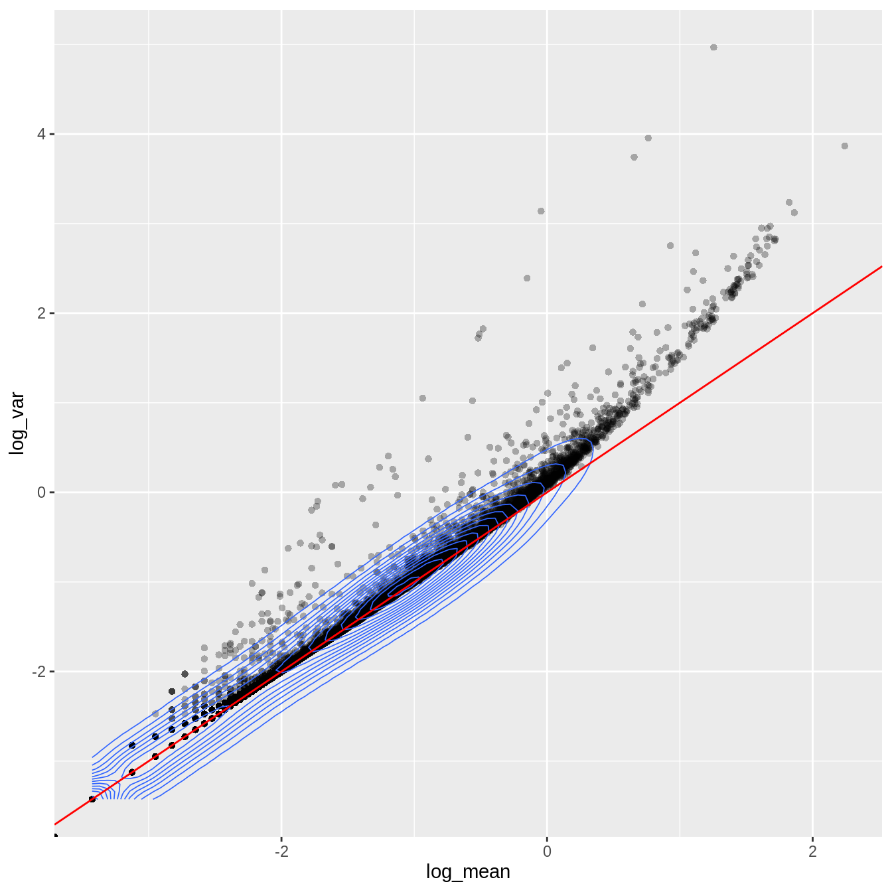

    
```{r include=FALSE}
library(tidyr)
library(dplyr)
```

## Outline

* Motivation

* Initial methods

* Deconvolution

* sctransform

## Workflow

```{r echo=FALSE, out.width='60%', fig.align='center'}
knitr::include_graphics('Images/workflow2.png')
```

## Workflow

```{r echo=FALSE, out.width='60%', fig.align='center'}
knitr::include_graphics('Images/workflow2_normalisation.png')
```

## Motivation

Systematic differences in sequencing coverage between libraries occur because of:

* low input material,
* differences in cDNA capture
* differences in PCR amplification.

Normalisation removes such differences
so that differences between cells are not technical but biological,
allowing meaningful comparison of expression profiles between cells.

Normalisation and batch correction have different aims:

Normalisation addresses technical differences only, while batch correction
considers both technical and biological differences.

Sources: chapters on normalisation in the
[OSCA book](https://bioconductor.org/books/release/OSCA/normalization.html), the
[Hemberg group materials](https://scrnaseq-course.cog.sanger.ac.uk/website/index.html) and [sctransform](https://github.com/ChristophH/sctransform).

## Initial methods

* In scaling normalization, the “normalization factor” is an estimate of the
library size relative to the other cells.

* Steps usually include:
  * computation of a cell-specific 'scaling' or 'size' factor
    * that represents the relative bias in that cell
  * division of all counts for the cell by that factor to remove that bias.
    
* Assumption: any cell specific bias will affect genes the same way.

## Examples

CPM: convert raw counts to counts-per-million (CPM)

  * for each cell
  * by dividing counts by the library size then multiplying by 1.000.000.
  * does not address compositional bias caused by highly expressed genes that are also
differentially expressed between cells.

<!-- ## Examples --> 

DESeq's size factor

  * For each gene, compute geometric mean across cells.
  * For each cell
    * compute for each gene the ratio of its expression to its geometric mean,
    * derive the cell's size factor as the median ratio across genes.
  * Not suitable for sparse scRNA-seq data as the geometric mean is computed on non-zero
values only.

## Deconvolution

Deconvolution strategy [Lun et al 2016](https://genomebiology.biomedcentral.com/articles/10.1186/s13059-016-0947-7/):

```{r, echo=FALSE, out.width = '100%'}
knitr::include_graphics("../Images/scran_Fig3c2.png", auto_pdf = TRUE)
```

Steps:

* compute scaling factors,
* apply scaling factors

## sctransform

<div class="columns-2">

With scaling normalisation a correlation remains between the mean and variation
of expression (heteroskedasticity).

This affects downstream dimensionality reduction as the few main new dimensions are usually correlated with library size.

sctransform addresses the issue by:

* regressing library size out of raw counts
* providing residuals to use as normalized and variance-stabilized expression values 

<!-- Mean-variance relationship -->

{width=80%}
</div>

<!--
https://rawgit.com/ChristophH/sctransform/supp_html/supplement/variance_stabilizing_transformation.html
For the genes, we can see that up to a mean UMI count of ca. 0.1 the variance follows the line through the origin with slop one, i.e. variance and mean are roughly equal as expected under a Poisson model. However, genes with a higher average UMI count show overdispersion compared to Poisson.
-->

## sctransform

Variables

* model the expression of each gene as a negative binomial random variable
with a mean that depends on other variables

* which model the differences in sequencing depth between cells

* and used as independent variables in a regression model

Regression

* fit model parameters for each gene

* combine data across genes using the relationship between gene mean and parameter values to fit parameters

* transform each observed UMI count into a Pearson residual
  * ~ number of standard deviations away from the expected mean 

* expect mean of 0 and stable variance across the range of expression

## sctransform

Example of the transformation outcome for two genes:

* UMI counts and pearson residuals against library size
* with expected UMI counts in pink

```{r, echo=FALSE, out.width = '40%'}
knitr::include_graphics("../Images/sctransform2.png", auto_pdf = TRUE)
```

## Recap

Early methods developed for bulk RNA-seq are not appropriate for sparse scRNA-seq data.

The deconvolution method draws information from pools of cells to derive cell-based scaling factors.

The sctransform method uses sequencing depth and information across genes to stabilise expression variance across the expression range.

