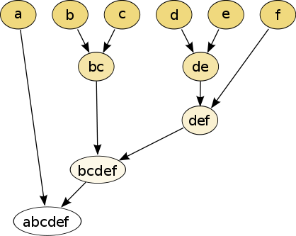

    
<!--
    logo: Images/CRUK_CC_web.jpg
-->

```{r include=FALSE}
library(tidyr)
library(dplyr)
#source("SOME_SCRIPT.R")
```

## Outline

* Motivation

* Initial methods

* Graph-based methods
  * walktrap
  * louvain
  * leiden

## Single Cell RNAseq Analysis Workflow

```{r, echo=FALSE, out.width='70%', fig.align='center'}

```

## Motivation

The data has been QCed and normalized, confounders removed, noise limited, 
dimensionality reduced.
  
We can now ask biological questions.

* *de novo* discovery and annotation of cell-types based on transcription profiles

* unsupervised clustering:

  * identification of groups of cells
  * based on the similarities of the transcriptomes
  * without any prior knowledge of the labels
  * usually using the PCA output

## Single Cell RNAseq Analysis Workflow

```{r, echo=FALSE, out.width='100%', fig.align='center'}
knitr::include_graphics("../Images/Andrews2017_Fig1.png", auto_pdf = TRUE)
```

## Motivation

We will introduce three widely used clustering methods:

* hierarchical
* k-means
* graph-based 

The first two were developed first and are faster for small data sets.

The third is more recent and better suited for scRNA-seq, especially large data sets.

All three identify non-overlapping clusters.

## Hierarchical clustering

Hierarchical clustering builds:

* a hierarchy of clusters
* yielding a dendrogram (i.e. tree)
  * that groups together cells with similar expression patterns
  * across the chosen genes.

There are two types of strategies:

* Agglomerative (bottom-up):
  * each observation (cell) starts in its own cluster,
  * pairs of clusters are merged as one moves up the hierarchy.
* Divisive (top-down):
  * all observations (cells) start in one cluster,
  * splits are performed recursively as one moves down the hierarchy.

<!-- ## Hierarchical 

```{r clust-hierarch-raw, echo=FALSE, out.height = '30%', fig.align='center'}
knitr::include_graphics("../Images/bioCellGenHierar1.png")
```
-->

<!-- ## Hierarchical 

```{r clust-hierarch-dendr, echo=FALSE, out.height = '30%', fig.align='center'}

```
-->

## Hierarchical clustering {.columns-2 .smaller}

The raw data:

```{r, echo=FALSE, out.width = '40%', fig.align='center'}
knitr::include_graphics("../Images/bioCellGenHierar1.png")
```

<p class="forceBreak"></p>

The hierarchical clustering dendrogram:

```{r, echo=FALSE, out.width = '60%', fig.align='center'}

```

## Hierarchical clustering {.columns-2 .smaller}

Example: the Caron data set:

```{r clust-hierarch-dendr-caron, echo=FALSE, out.height = '80%', out.width = '80%',  fig.align='center'}

```

<p class="forceBreak"></p>

Pros:

* deterministic method
* returns partitions at all levels along the dendrogram
    
Cons:

* computationally expensive in time and memory
  * that increase proportionally
  * to the square of the number of data points

## k-means clustering {.columns-2 .smaller}

Goal: partition cells into k different clusters.

In an iterative manner,

* cluster centers are defined
* each cell is assigned to its nearest cluster

Aim:

* minimise within-cluster variation
* maximise between-cluster variation

<p class="forceBreak"></p>

Pros:

  * fast
    
Cons:

  * assumes a pre-determined number of clusters
  * sensitive to outliers
  * tends to define equally-sized clusters
    
## k-means clustering

```{r, echo=FALSE, out.width = '100%'}
knitr::include_graphics("../Images/bioCellGenKmean.png", auto_pdf = TRUE)
```

Set of steps to repeat:

* randomly select k data points to serve as initial cluster centers,
* for each centers, 1) compute distance to centroids, 2) assign to closest cluster,
* calculate the mean of each cluster (the ‘mean’ in ‘k-mean’) to define its centroid,
* for each point compute the distance to these means to choose the closest,
* repeat until the distance between centroids and data points is minimal (ie clusters do not change)
  or the maximum number of iterations is reached,
compute the total variation within clusters

<!--
**=> assign new centroids and repeat steps above**
-->

## Separatedness

Congruence of clusters may be assessed by computing the sillhouette for each cell.

The larger the value the closer the cell to cells in its cluster than to cells in other clusters.

Cells closer to cells in other clusters have a negative value.

Good cluster separation is indicated by clusters whose cells have large silhouette values.

```{r, echo=FALSE, out.width = '100%'}
knitr::include_graphics("../Images/clustKmeansBoth.png", auto_pdf = TRUE)
```


## Graph-based clustering {.columns-2 .smaller}

Nearest-Neighbour (NN) graph:

  * cells as nodes
  * their similarity as edges
  
Aim: identify ‘communities’ of cells within the network

In a NN graph two nodes (cells), say X and Y, are connected by an edge:

if the distance between them is amongst:

  * the **k** smallest distances from X to other cells, ‘**K**NN’)
  * and from Y to other cells for **shared**-NN, ‘**S**NN’.
  
<p class="forceBreak"></p>

Clusters are identified using metrics related to the number of neighbours (‘connections’) to find groups of highly interconnected cells.

```{r, include=FALSE}
require(igraph)
g <- make_graph( ~ A-C:D:F:G:H, B-D:E:F:H:I)
cols <- c("red", "red",
          "orange", "lightblue", "orange",
          "lightblue",
          "orange", "lightblue", "orange")
names(cols) <- c(LETTERS[1:9])
```

```{r, fig.width = 5, fig.height = 5, echo=FALSE}
#, fig.align="center"
plot.igraph(
  g, layout = layout_with_fr(g),
  vertex.size = 20,
  vertex.color = cols[names(V(g))]
)
```

## Graph-based clustering

Example with different numbers of neighbours:

```{r, echo=FALSE, out.height='60%', out.width = '60%', fig.align="center"}
knitr::include_graphics("../Images/bioCellGenGraphDeng2.png", auto_pdf = TRUE)
```

## Graph-based clustering

Pros

  * fast and memory efficient (no distance matrix for all pairs of cells)
  * no assumptions on the shape of the clusters or the distribution of cells within each cluster
  * no need to specify a number of clusters to identify
  
Cons

  * loss of information beyond neighboring cells, which can affect community detection in regions with many cells.

## Modularity

Several methods to detect clusters (‘communities’) in networks rely on the ‘modulatrity’ metric.

For a given partition of cells into clusters,

modularity measures how separated clusters are from each other,

based on the difference between the observed and expected weight of edges between nodes.

For the whole graph, the closer to 1 the better.

## Walktrap

The walktrap method relies on short random walks (a few steps) through the network.

These walks tend to be 'trapped' in highly-connected regions of the network.

Node similarity is measured based on these walks.

* Nodes are first each assigned their own community.
* Pairwise distances are computed and the two closest communities are grouped.
* These steps are repeated a given number of times to produce a dendrogram.
  * Hierarchical clustering is applied to the distance matrix.
* The best partition is that with the highest modularity.

<!-- https://link.springer.com/article/10.1007/s11227-019-03018-x -->

## Walktrap

Network example:

```{r, echo=FALSE, out.height='60%', out.width = '60%', fig.align="center"}
knitr::include_graphics("../Images/clusGraphExample.png", auto_pdf = TRUE)
```

## Louvain {.columns-2 .smaller}

Hierarchical agglomerative method

Nodes are also first assigned their own community.

Two-step iterations:

* nodes are re-assigned one at a time to the community for which they increase modularity the most,
* a new, 'aggregate' network is built where nodes are the communities formed in the previous step.

This is repeated until modularity stops increasing.

([Blondel et al, Fast unfolding of communities in large networks](https://iopscience.iop.org/article/10.1088/1742-5468/2008/10/P10008/meta))

<p class="forceBreak"></p>

```{r, echo=FALSE, out.height='80%', out.width = '80%', fig.align="center"}
knitr::include_graphics("../Images/leiden_Fig1_noLegend.png", auto_pdf = TRUE)
```

([Traag et al, From Louvain to Leiden: guaranteeing well-connected communities](https://www.nature.com/articles/s41598-019-41695-z))

## Leiden

Issue with the Louvain method: some communities may be disconnected:

```{r, echo=FALSE, out.height='60%', out.width = '60%', fig.align="center"}
knitr::include_graphics("../Images/leiden_Fig2_HTML.png", auto_pdf = TRUE)
```

([Traag et al, From Louvain to Leiden: guaranteeing well-connected communities](https://www.nature.com/articles/s41598-019-41695-z))

## Leiden {.columns-2 .smaller}

The Leiden method improves on the Louvain method

by garanteeing that at each iteration clusters are connected and well-separated.

The method includes an extra step in the iterations:

* after nodes are moved (step 1),
* the resulting partition is refined (step2)
* and only then the new aggregate network made, and refined (step 3).

<p class="forceBreak"></p>

```{r, echo=FALSE, out.height='100%', out.width = '100%', fig.align="center"}
knitr::include_graphics("../Images/leiden_Fig3_noLegend.png", auto_pdf = TRUE)
```

([Traag et al, From Louvain to Leiden: guaranteeing well-connected communities](https://www.nature.com/articles/s41598-019-41695-z))

## Cluster-wise modularity to assess clusters quality 

Clusters that are well separated mostly comprise intra-cluster edges and harbour a high modularity score on the diagonal and low scores off that diagonal.

Two poorly separated clusters will share edges and the pair will have a high score.

```{r, echo=FALSE, out.height='100%', out.width = '100%', fig.align="center"}
knitr::include_graphics("../Images/clustLouvainBoth.png", auto_pdf = TRUE)
```

## Recap

* hierarchical and k-means methods are fast for small data sets

* graph-based methods are better suited for large data sets and cluster detection
