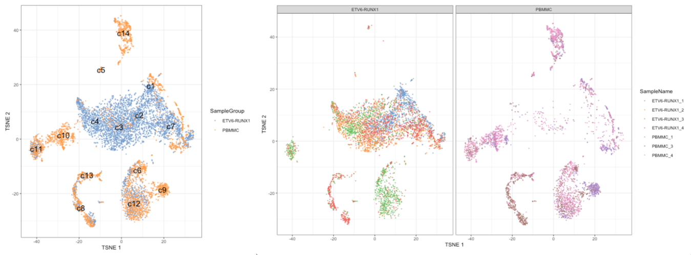

```{r, include = FALSE}
library(scater)
library(patchwork)
library(knitr)
opts_chunk$set(echo = FALSE)
```

## Outline

* Motivation

* Differential expression

* Differential abundance
  
## Single Cell RNAseq Analysis Workflow

```{r, echo=FALSE, out.width='100%', fig.align='center'}
knitr::include_graphics("../Images/Andrews2017_Fig1.png", auto_pdf = TRUE)
```

## Motivation

Clusters and/or cell types have been identified, we now want to compare sample groups:

* which genes vary in expression
* which clusters differ in abundance

Replicates are samples not cells:

* single cells within a sample are not independent of each other,
* using cells as replicates amounts to study variation among an individual
* while we want to study variation across a population

Pseudo-bulk:

* gene expression levels for each cluster in each sample
* are obtained by summing across cells

## Differential expression between conditions

An example. TSNE plots showing clusters and sample groups (left) and samples (right):

```{r, out.height='50%', out.width='100%'}

```

## Differential expression between conditions

Workflow:

- compute pseudo-bulk count by summing across cells,

  * per cluster and per sample
  
- perform bulk analysis with few replicates,

  * for each cluster separately

Method:

- quasi-likelihood (QL) methods from the `edgeR` package

- negative binomial generalized linear model (NB GLM)

  * to handle overdispersed count data
  * in experiments with limited replication

## Differential expression between conditions

Steps:

- Remove samples with very low library sizes, e.g. < 20 cells

  * better normalisation
  
- Remove genes that are lowly expressed,

  * reduces computational work,
  * improves the accuracy of mean-variance trend modelling
  * decreases the severity of the multiple testing correction
  * filter: log-CPM threshold in a minimum number of samples, smallest sample group

- Correct for composition biases

  * by computing normalization factors with the trimmed mean of M-values method
  
- Test whether the log-fold change between sample groups is significantly different from zero

  * estimate the negative binomial (NB) dispersions
  * estimate the quasi-likelihood dispersions, uncertainty and variability of the per-gene variance
  
  
## Differential abundance between conditions

Aim: test for significant changes in per-cluster cell abundance across conditions

Example: which cell types are depleted or enriched upon treatment?

Methods: developed for flow cytometry.

Steps:

- Count cells assigned to each label, i.e. cluster or cell type

- Same workflow as for differential expression above,

  * except counts are of cells per label, not of reads per gene 
  
- Share information across labels

  * to improve our estimates of the biological variability in cell abundance between replicates.

