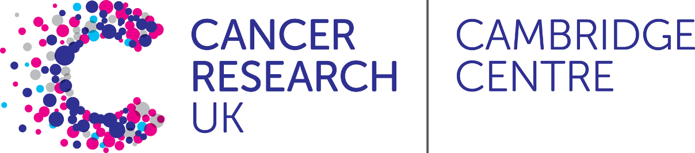

# Introduction to single-cell RNA-seq data analysis 
### 4th, 11th and 18th Nov 2021
#### Taught remotely
#### Bioinformatics Training, Craik-Marshall Building, Downing Site, University of Cambridge

## Instructors

* Abigail Edwards - Bioinformatics Core, Cancer Research UK Cambridge Institute
* Ashley Sawle - Bioinformatics Core, Cancer Research UK Cambridge Institute
* Hugo Tavares - Bioinformatics Training Facility, University of Cambridge
* Katarzyna Kania - Genomics Core, Cancer Research UK Cambridge Institute
* Stephane Ballereau - Bioinformatics Core, Cancer Research UK Cambridge Institute

## Outline

This workshop is aimed at biologists interested in learning how to perform
standard single-cell RNA-seq analyses. 

This will focus on the droplet-based assay by 10X genomics and include running
the accompanying `cellranger` pipeline to align reads to a genome reference and
count the number of read per gene, reading the count data into R, quality control,
normalisation, data set integration, clustering and identification of cluster
marker genes, as well as differential expression and abundance analyses.
You will also learn how to generate common plots for analysis and visualisation
of gene expression data, such as TSNE, UMAP and violin plots.

We have run this course twice and are still learning how to teach it remotely.
Please bear with us if there are any technical hitches, and be aware that timings
for different sections laid out in the schedule below may not be adhered to.
There may be some necessity to make adjusments to the course as we go.

> ## Prerequisites
>
> __**Some basic experience of using a UNIX/LINUX command line is assumed**__
> 
> __**Some R knowledge is assumed and essential. Without it, you
> will struggle on this course.**__ 
> If you are not familiar with the R statistical programming language we
> strongly encourage you to work through an introductory R course before
> attempting these materials.
> We recommend our [Introduction to R course](https://bioinformatics-core-shared-training.github.io/r-intro/)

## Data sets

Two data sets:

* '[CaronBourque2020](https://www.nature.com/articles/s41598-020-64929-x)': pediatric leukemia, with four sample types, including:
  * pediatric Bone Marrow Mononuclear Cells (PBMMCs)
  * three tumour types: ETV6-RUNX1, HHD, PRE-T  
* ['HCA': adult BMMCs](https://data.humancellatlas.org/explore/projects/cc95ff89-2e68-4a08-a234-480eca21ce79) (ABMMCs) obtained from the Human Cell Atlas (HCA)
  * (here downsampled from 25000 to 5000 cells per sample)

